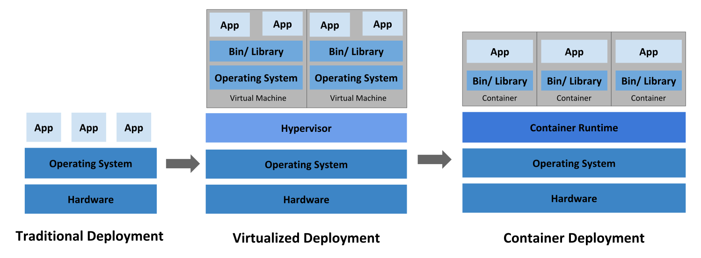
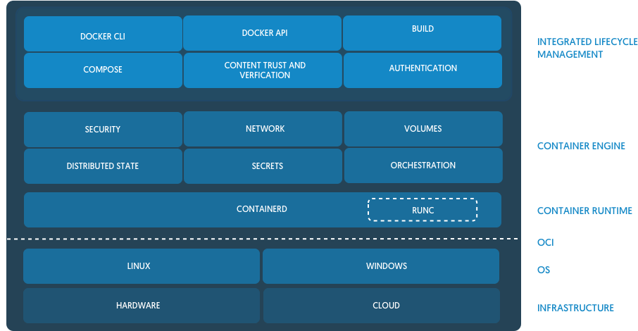
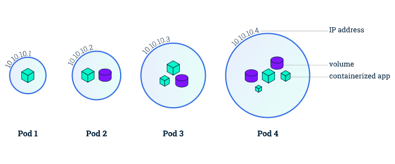
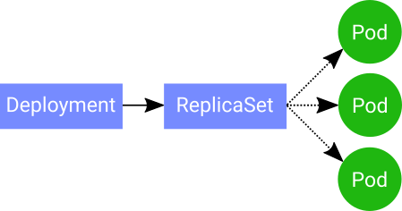

**Repositório GitHub**
======================
Esse repositório tem como intuído ser um guia para o aprendizado de Kubernetes.

A ideia é apresentar os conceitos e propor pequenos laboratórios para que seja possível realizar testes baseado na criação de um Infraestrutura como Código(IaC) com o Vagrant.

> Este é um repositório aberto para Sugestões de Melhorias e Inclusão de nova informações.

**Introdução a Kubernetes**
===========================

Kubernetes providencia um framework para executar, de forma resiliente, sistemas distribuidos, realizando um conjunto de processos para controlar conteineres gerenciando cargas de trabalho e automatizando o deploy de serviços/aplicações que são containerizados.

O Kubernetes nasceu de um projeto Open Source criado pelo Google em 2014 chamado Borg que derivou, além do Kubernetes, o Meso e CloudFoundry.

### Certificação

Kubernetes contém duas certificações:
* CKA - Certified Kubernetes Administrator
* CKAD - Certified Kubernetes Application Developer

No curso iremos abordar os conceitos da  **[CKA (Certified Kubernetes Administrator)](https://www.cncf.io/certification/cka/)** conforme os seguintes tópicos:

Topico | Peso
------ | -----------
Application Lifecycle Management | 8%
Installation, Configuration & Validation | 12%
Core Concepts | 19%
Networking | 11%
Scheduling | 5%
Security | 12%
Cluster Maintenance | 11%
Logging / Monitoring | 5%
Storage | 7%
Troubleshooting | 10%

Os tópicos podem ser melhor elucidados pelo **[CKA Curriculum](https://github.com/cncf/curriculum/blob/master/CKA_Curriculum_V1.14.1.pdf)**

---

Tipos de Deploys
----------------
Para entender a importancia do Kubernetes atualmente no mercado é necessário observar a mudança de visão em relação a entrega de aplicações.

* **Deploy Tradicional**
  - Aplicações em Servidores Fisicos.
  - Recursos não escalaveis
  - Alto Custo de Recursos
* **Deploy em Virtualização**
  - Multiplos Serviços em um servidor.
  - Aumento de Escalabilidade e Segurança
  - Isolamento das aplicações em relação ao Host principal
  - Redução de Custos
* **Deploy em Containers**
  - Isolamento do Ambiente
  - Ambientes Leves
  - Alto poder de escalabilidade
  - Desacoplado da infraestrutura básica

Conceito de Container
---------------------
> Curiosidade: Kubernetes vem do Grego e significa **timoneiro** ou **piloto**

Isolamento de ambiente a nível de processo. Uma aplicação auto-contida criada com uma imagem base do qual contém todas as dependencias necessárias.
  * Nível de Isolamente:
    - Próprio filesystem, definições de rede, gerencia de processos e etc.
  * Comunicação direta com o Kernel da máquina Host:
    - cgroups: Permite a limitação dos recursos para cada processo
    - namespaces: Limite a área de compartilhamento/visualização dos recursos (rede, processos, filesystem, etc)
    - Union filesystem: FileSystem em camadas (já existentes - snapshots) com o conceito de _copy-on-write_, gerando uma camada superficial de escrita

**Container Runtime**: São os gerenciadores dos componentes utilizados por um container
Há inúmeros Containers Runtime como:
* [Docker](https://www.docker.com/)
* [containerd](https://containerd.io/)
* [CRI-O](https://cri-o.io/)
* [KataContainers](https://katacontainers.io/)
* Entre outros.

Diagrama de Container Runtime - Baseado em Docker

### Caracteristicas do Kubernetes
Com os conceitos basicos definidos podemos ver

* `Service Discovery e LoadBalancer` - Distribuição do alto tráfego baseado na descoberta de serviços (DNS, IP, Variaveis de Ambiente) até estabilizar a aplicação.
* `Storage Orchestration` - Orquestração de Storage - Gerenciar a montagens de volumes de armazenamento.
* `Automated Rollouts e Rollbacks` - Controle do estado do deploy nos containers. (Baseado no Estado Desejado).
* `Automação do Uso de Recursos` - Kubernetes consegue adequar o container no melhor node para utilização de recursos.
* `Self-healing` - Kubernetes reinicia, troca ou mata um container em caso de falhas.
* `Secret and configuration management` - Faz o gerenciamento de dados sensiveis (Senhas, Tokens, chaves, etc)

---

**Componentes do Cluster**
==========================
Para podermos trabalhar com o cluster Kubernetes e necessário entender alguns componentes que são utilizados, seja nas máquinas Master ou Nodes.

### Componentes do Master (Control Plane)
* **Control Plane** - Camada de Orquestração de Container que define, implanta e gerencia os ciclo de vida dos containers

* `kube-apiserver`
  - API Server componente que expõe o Kubernetes API.
  - Frontend para o _Control Plane_
  - Faz a comunicação entre master e nodes.
* `etcd`
  - Banco de Dados compartilhado.
  - Armazenamento de chave e valor altamente disponivel.
  - Armazena todas as informações do cluster.
* `kube-schedule`
  - Scheduler - Processo responsável por determinar node que será provisionado os PODs.
  - Tomada de Decisão do Scheduler depende de inúmeros fatos como:
    - Recursos Individuais ou coletivos
    - Hardware ou Software
    - Politicas de Afinidade ou Anti-Afinidade e etc.
* `kube-controller-manager` e `cloud-controller-manager`
  - Controllers - Responsável pela verificação do estado atual do cluster através do API SERVER.
  - _Tipos de Controllers_:
    - Node Controller: Responsavel por validar o estado do node
    - Replication Controller: Responsavel por manter o número correto pods em cada Replication Controller System.
    - Endpoints Controller: Popula Endpoints(Une Serviços e Pods)
    - Service Account & Token Controllers: Define tokens e contas para um novo namespace.
  - cloud-controller-manager - Permite a interação com provedores de cloud.

### Componentes do Node

* `kubelet`
  - Serviço - Agente executado em cada node do cluster.
  - Permite o ingresso do node no cluster.
  - Gerencia e Garante que as especificações de Pods(PodSpecs) estão rodando e saudaveis dentro do container
    - NÃO gerencia containers que não foram criados pelo Kubernetes.
  - Arquivo Config: _/var/lib/kubelet/config.yaml_
* `kube-proxy`
  - É um proxy de rede executado em cada node
  - Permite comunicação do cluster (IPTables do K8S)
  - Mantém configurações e regras de rede.
* `Container Runtime`:
  - Software responsável por gerenciar os containers em execução.
  - Suporta: Docker, Containerd, cri-o, rktlet e outros.

---

**Objetos do Cluster**
======================
Por fim, temos os objetos do Kubernetes, que são as ações que podemos utilizar no Kubernetes.
Há inúmeros objetos, porém iremos abordar os principais objetivos:

Namespace
---------
Multiplos clusters virtuais no mesmo cluster fisico.
Um ambiente para a execução de, por exemplo, projeto distintos.
Utilizado para dividir projetos ou times que utilizam o Kubernetes.
* Principais Namespaces:
  - **default** - Namespace Padrão
  - **kube-system** - Namespace de objetos criados para suportar o ambiente Kubernetes

POD
---
É a **unidade minima** do Kubernetes, pode conter um ou mais containers.
* Conjunto de Containes (No minimo um container)
* Compartilham interface de rede(IP Address Exclusivo) e volumes.
* Geralmente é gerenciado por um _Deployment_ por isso representa uma unidade do Deployment

#### Service
É a Forma de expor a aplicação como um serviço de rede, ou seja, cria um ponto de acesso para um conjunto de pods.
* Basicamente define um politica de acesso aos PODs.
* Os Pods do Service são determinados por um _Selector_ (Filtro de Recursos baseado em **LABEL**)
* Basicamente é um LoadBalancer entre os PODs ativos e filtrados.

#### Volume
É um diretório contendo informações acessiveis por um container em um POD.
Volume no Kubernetes tem a vida útil relacionada ao Pod.
* Tipos de Volumes:
  - **emptyDir** - Volume não persistente
  - **hostPath** - Volume Persistente Local.
  - **PersistentVolume (PV)** - Disponibiliza volume persistente para o cluster baseado em um Storage.
    - Tipos Suportados: NFS, ISCSI, GlusterFS, CEPH, etc.
  - **PersistentVolumeClaim (PVC)** - Requisita um volume persistente.

Em resumo o Pod utiliza um PVC (PersistentVolumeClaim) que solicita um PV (PersistemVolume), que está disponivel em todo o cluster. Após a solicitação o Volume é montado dentro do ambiente.

Deployment
----------
Objeto que prove provisionamento da sua aplicação baseado em um estado desejado com especificações de container identicas.
* Realiza o Controle do atualização/provisionamento dos Pods e ReplicaSets
  - Permite a substituições de pods em caso de falha.
* Utiliza o conceito de _Strategy_ para definir uma estrátegia de deploy.
* Define a quantidade de replicas do provisionamento.

ReplicaSet
----------
Tem como objetivo manter um conjunto de replicas de Pods sendo executado.
* Identifica os pods que serão replicados por um _Selector_.
* Especifica a quantidade de replicas.
* Baseado em um template de Pods, usado para criar novos Jobs.

StatefulSet
-----------
Gerencia Pods com especificações identicas de containers, porém para cada Pod há uma identificação fixa que é mantido em atualizações.
* Utilizado quando há necessidade de identificadores de rede e volumes persistente estaveis,
* Ou na necessidade de Provisionamento, Scalling ou Atualizações automatizadas e ordenadas.
* Geralmente utilizado quando há necessidade de utilização de banco de dados.

DaemonSet
---------
Garante que em cada cluster haverá uma copia do Pod.
*  Alocação de Pods em cada cluster ativo.
* Para executar, por exemplo, a configuração de um cluster de volumes, coleta de logs ou monitoramento do ambiente. Já que sempre haverá um Pod configurado nos nodes.

> Glossário Kubernetes: https://kubernetes.io/docs/reference/glossary/
